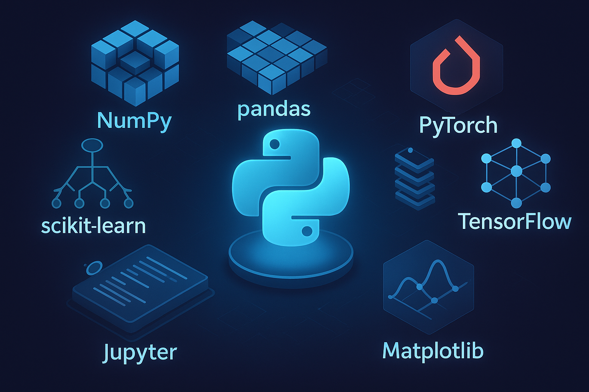

<h1 align="center">UCSD ECE Summer Internship Prep Program</h1>
<h2 align="center">Python and Machine Learning Workshop</h2>

Girish Krishnan | <a href="https://www.linkedin.com/in/girk">LinkedIn</a> | <a href="https://github.com/Girish-Krishnan">GitHub</a>

    

    
    

This repository collects small but complete examples for learning scientific computing and machine learning with Python. The code is organized by topic so you can jump directly to the areas that interest you.

## Directory overview
- **`0_Foundations/`** – introductory pandas examples for data analysis and visualization.
- **`1_Supervised_ML/`** – basic supervised machine learning tutorials using scikit-learn.
- **`2_Unsupervised_ML/`** – clustering and dimensionality reduction examples with scikit-learn.
- **`3_Deep_Learning/`** – PyTorch based training scripts from simple MLPs to transfer learning.
- **`4_NLP/`** – natural language processing tutorials using Hugging Face Transformers, covering text classification, tokenization, and more.
- **`5_OpenCV/`** – webcam and image processing demos using OpenCV.
- **`6_Time_Series/`** – simple time series analysis examples using pandas and statsmodels.
- **`7_Reinforcement_Learning/`** – short Stable Baselines3 examples using Gym.
- **`8_Applications/`** – fun demos using Mediapipe, YOLO, Segment Anything and more.
